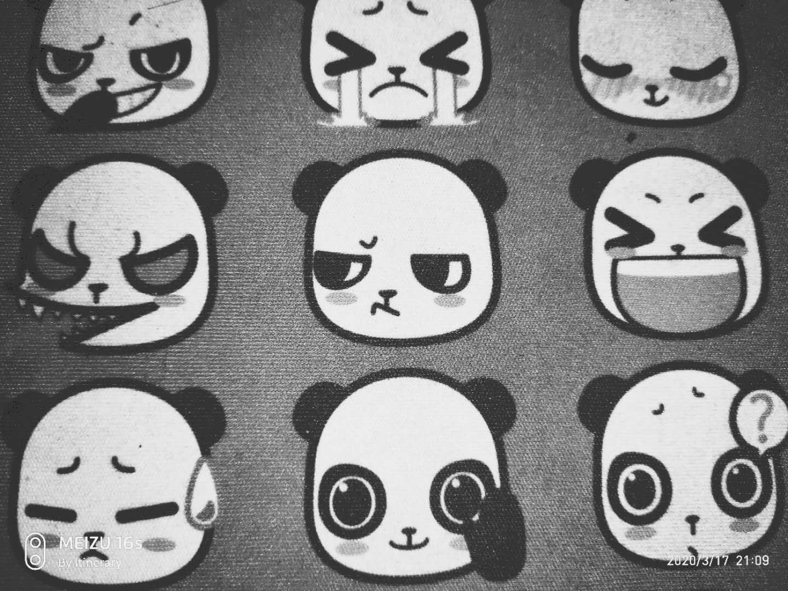
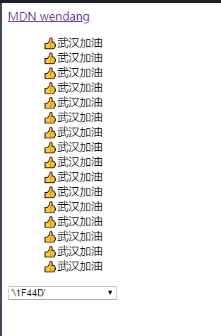
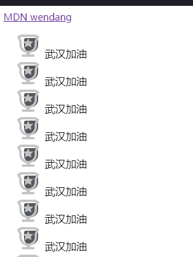
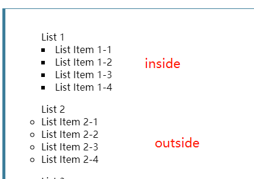

​      list-style属性是一个简写对集合属性。包括的值有：[`list-style-type`](https://developer.mozilla.org/zh-CN/docs/Web/CSS/list-style-type), [`list-style-image`](https://developer.mozilla.org/zh-CN/docs/Web/CSS/list-style-image), 和 [`list-style-position`](https://developer.mozilla.org/zh-CN/docs/Web/CSS/list-style-position)。主要用于`<ul><li></li></ul>`html元素上。

###  list-style-type

该属性可以设置列表元素前面的符号。默认是一个实心圆点（也就是取值为`disc`）。提供了许多默认值可供选择。下面的例子取的值为`list-style-type: cambodian;`。关于具体有哪些值，可以[查看这里](https://codepen.io/24min/pen/ExjRora)或者MDN文档。

<ul style="list-style-type: cambodian;"><li>武</li><li>汉</li><li>加</li><li>油</li></ul>

其次，也支持`unicode`字符以及自定义的符号。比如我们可以取值`list-style-type:'\1F44D'`，那么最后出来的结果，就如下图所示：（同样的如果我们设置`list-style-type:'中国'`，那么最后出来的结果会在每个列表前面加上中国）

------

### list-style-image

 **`list-style-image`** 属性用来指定一个能用来作为列表元素标记的图片。这个值其实是`list-style-type`的补充。为什么这么讲呢？当这个值被设置的时候，那么`list-style-type`的值就不会起作用。你可以通过个性化的图片来表达设计理念。`list-style-image:url(https://a.msstatic.com/huya/main3/widget/sidebar/img/sidebar-icon-match_ac6a1.png)`这么取值，我们将看到如下所示：

------

### list-style-position

​     `list-style-position`属性用于定义标记（符号索引）的位置。主要关键的取值为`inside`和`outside`。默认值为`outside`。下面的图片可以很好的区分出这两个属性的区别。

------

### 参考资料

- [MDN文档关于list-type的描述](https://developer.mozilla.org/zh-CN/docs/Web/CSS/list-style)
- [unicode字符集对应html js css](https://blog.csdn.net/qq_26090065/article/details/81589817)