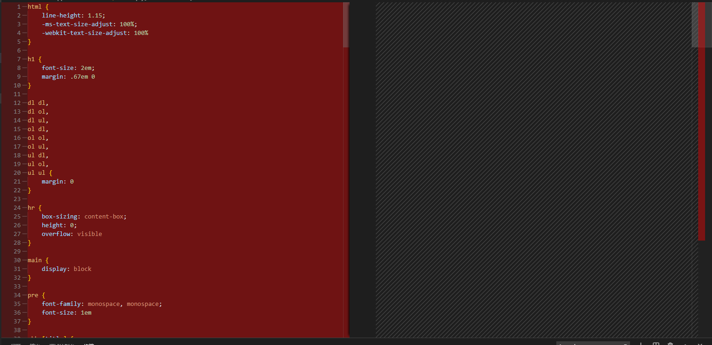

# 前言

前几天，在一个`vue`项目中的`package.json`文件中偶然看到有个`browserslist`的配置

```json
{
    "browserslist": [
    "> 1%",
    "last 2 versions"
  ]
}
```

第一反应是，这是啥？浏览器列表？那么下面的`> 1%`以及`last 2 versions`又代表什么呢？这个配置有什么用？


带着这些疑问，带上我的键盘，开始疯狂在网上冲浪。

# [browserslist](https://github.com/browserslist/browserslist)

（ `Browserslist is a standard place to find project’s target browsers` ）原来`browserslist`的配置是指查询出符合条件的浏览器供一些工具使用以达到适配浏览器的作用，其中的每个字段都代表的是查询条件。比如上述的`last 2 versions`代表的是为最近两个版本的浏览器适配代码。那么一大串的问题又接踵而来了，都有哪些查询条件？我可以看到查询出来的浏览器吗？适配的代码是包括`javascript`以及`css`吗？and more...


# Q1：查询的数据来自哪里？

**解：**

>  `Developers set versions list in queries like `last 2 version` to be free from updating versions manually. Browserslist will use [Can I Use](https://caniuse.com/) data for this queries.` 

显而易见，来自[Can I Use](https://caniuse.com/)。

# Q2：都有哪些查询条件？

**解：**

关于有哪些查询条件（不区分大小写）我们也可以在`browserslist`的`github`仓库中找到原文。下面将会做一些搬运以及翻译工作。

-   `> 5%`: browsers versions selected by global usage statistics. `>=`, `<` and `<=` work too. （统计全球范围内使用率大于n%的浏览器版本，也可以使用大于等于，小于 以及小于等于）
-  `> 5% in US`: uses USA usage statistics. It accepts [two-letter country code](https://en.wikipedia.org/wiki/ISO_3166-1_alpha-2#Officially_assigned_code_elements). （同上，只不过地域限制在美国。统计在美国范围内使用率大于n%的浏览器版本）
-  `5% in alt-AS`: uses Asia region usage statistics. List of all region codes can be found at [`caniuse-lite/data/regions`](https://github.com/ben-eb/caniuse-lite/tree/master/data/regions). （同上述，只不过区域 被限制在了亚洲。）
-  `> 5% in my stats`: uses [custom usage data](https://github.com/browserslist/browserslist#custom-usage-data). （同上述，只不过支持在自定义数据中查找）
-  `cover 99.5%`: most popular browsers that provide coverage. （全球范围内最受欢迎的浏览器，同样上述也支持地域参数）
-  `maintained node versions`: all Node.js versions, which are [still maintained](https://github.com/nodejs/Release) by Node.js Foundation. （所有官方仍在维护的node版本）
-  `node 10` and `node 10.4`: selects latest Node.js `10.x.x` or `10.4.x` release. （最新的大版本为10或者中版本为10.4的node版本）
-  `current node`: Node.js version used by Browserslist right now. （目前被Browserslist 使用的node版本）
-  `extends browserslist-config-mycompany`: take queries from `browserslist-config-mycompany` npm package. （从npm包`browserslist-config-mycompany`中查询）
-  `ie 6-8`: selects an inclusive range of versions. （选择特定浏览器的浏览版本）
-  `Firefox > 20`: versions of Firefox newer than 20. `>=`, `<` and `<=` work too. It also works with Node.js. （火狐20之上的版本，node也可以这么使用）
-  `iOS 7`: the iOS browser version 7 directly. （IOS7自带的浏览器版本，也可以类推到ios8等）
-  `Firefox ESR`: the latest [Firefox ESR] version. （最新的火狐ESR版本 ）
-  `PhantomJS 2.1` and `PhantomJS 1.9`: selects Safari versions similar to PhantomJS runtime. （选择和PhantomJS 运行时相似的Safari版本）
-  `unreleased versions` or `unreleased Chrome versions`: alpha and beta versions. （还处于内测阶段的Chrome版本）
-  `last 2 major versions` or `last 2 iOS major versions`: all minor/patch releases of last 2 major versions. （最近的两个发行版，包括所有的此版本号和补丁版本号变更的浏览器版本）
-  `since 2015` or `last 2 years`: all versions released since year 2015 (also `since 2015-03` and `since 2015-03-10`). （从2015年开始的所有浏览器发行版本或者最近两年内所有浏览器的发行版本，同样支持具体到月份的选择）
-  `dead`: browsers without official support or updates for 24 months.（那些超过24个月未更新或者官方宣布放弃的浏览器版本）
-  `last 2 versions`: the last 2 versions for *each* browser. （所有浏览器的最近两个版本）
-  `last 2 Chrome versions`: the last 2 versions of Chrome browser. （Chrome浏览器的最近两个版本）
-  `defaults`: Browserslist’s default browsers (`> 0.5%, last 2 versions, Firefox ESR, not dead`). （Broeserslist的默认配置）
-  `not ie <= 8`: exclude browsers selected by previous queries. （排除ie版本在8以下的）

**总结：**

通过提供的这么些查询方式的排列组合，我们可以找到我们中意的浏览器。最令我意想不到的是还可以支持时间检索（`since 2015` or `last 2 years`），竟然可以精确到日期（`since 2019-03-19`）。后来我又突发奇想，那么既然是搜索能否支持正则匹配搜索呢？经过实践，正则匹配搜索并不支持。那么能否支持区分手机浏览器与电脑浏览器的查询条件呢 ？我找了很久也没有找到，如果可以的话，希望dalao能够指点一二。

# Q3:   我可以看到查询出来的浏览器吗?

**解：**

当然可以。在当前`package.json`目录下执行命令`npx browserslist`，就可以查看到当前搜索条件下的浏览器（这个查出来的浏览器会随时间的不同而不同）。比如我想查询哪些浏览器已经停止维护了，就可以把命令修改为`dead`

```json
{
    "browserslist": [
        "dead"
    ]
}
```

结果：

```sh
PS E:\ltinerary\vue\document\my-project> npx browserslist
bb 10
bb 7
ie 10
ie 9
ie 8
ie 7
ie 6
ie 5.5
ie_mob 10
op_mob 12.1
op_mob 12
op_mob 11.5
op_mob 11.1
op_mob 11
op_mob 10
samsung 4
```


# Q4：查出来的这些简写都代表什么浏览器？

**解：**

在Q3中，通过命令查询到了符合条件的浏览器，那么相信大家会和我有这么些疑问 。比如`bb`是代表什么浏览器？baby浏览器？下面的表格列举了这些简写分别代表哪些浏览器。（基于`last 1 versions`）

| 查询出的浏览器简写 | 代表的浏览器                                                 |
| ------------------ | ------------------------------------------------------------ |
| `and_chr`          | 安卓谷歌浏览器（phone）                                      |
| `and_ff`           | 安卓火狐浏览器（phone）                                      |
| `and_qq`           | 安卓QQ浏览器（phone）                                        |
| `and_uc`           | 安卓UC浏览器（phone)                                         |
| `android`          | 安卓浏览器（phone）                                          |
| `baidu`            | 百度浏览器（PC）                                             |
| `bb`               | 这个存疑？我更倾向于 Baidu Browser，但是搜bb浏览器，真的能搜到。。。 |
| `chrome`           | `chrome`浏览器（PC）                                         |
| `edge`             | `Edge`浏览器（PC ：win10自带的浏览器）                       |
| `firefox`          | 火狐浏览器（PC）                                             |
| `ie`               | `IE`浏览器（PC）                                             |
| `ie_mob`           | 手机ie浏览器（phone）                                        |
| `ios_saf`          | safari（phone）                                              |
| `kaios`            | [kaios](https://zh.wikipedia.org/wiki/KaiOS)浏览器（也是一个移动操作系统上的浏览器） |
| `op_mini`          | Opera Mini（phone）                                          |
| `op_mob`           | opera手机浏览器（phone）                                     |
| `opera`            | opera浏览器（PC）                                            |
| `safari`           | safari浏览器（PC）                                           |
| `samsung`          | Samsung Internet 浏览器（phone）                             |


# Q5：其他工具是如何“利用”它的？

首先，对于前端开发者来说，我们可以通过`npx browserslist`命令来查看当前项目浏览器的适配情况。咱们人是这么利用它的，那么对于一些工具来说，他们是怎么使用的呢？我们该怎么配置呢？以下的各工具所使用的查询条件基于

```json
{
    "browserslist": [
    "last 1 versions",
     "ie 9"
    ]
}
```

当前时间下 （`Mon Nov 25 2019 20:42:55 GMT+0800 (中国标准时间)`）所查出来的浏览器列表比问题Q3的解多了一个`ie 9`。   接下来的各个工具分析的打包效果都会以下面的代码为基准。

```vue
<!--
 * @Author: 24min
 * @Date: 2019-11-18 21:15:10
 * @LastEditors: 24min
 * @LastEditTime: 2019-11-25 20:24:47
 * @Description: file content
 -->
<template>
  <div id="app">
    <div class="Autoprefixer"></div>
  </div>
</template>
<script>
export default {
  name: 'app',
},
 mounted(){
    /** Babel begin  es6*/
    const array = ['firstBabel', 'secondBabel', 'thirdBabel'];
    const [first, second] = array;
    console.log(`${first}-${second}`)
     /** Babel end*/
 }
</script>
<style>
 //Autoprefixer begin
.Autoprefixer{
  height: 100px;
  width: 100px;
  background-color: cadetblue;
  transform: skew(30deg, 20deg);
}
//Autoprefixer end
</style>
```


### 1.[Autoprefixer](https://github.com/postcss/autoprefixer)

` Autoprefixer`是一个给`css`代码自动添加浏览器私有属性的工具，它是属于 [PostCSS](http://postcss.org/) 的一个插件。在使用`@vue/cli`生成项目的时候，这个工具是默认安装使用的，具体我们可以在`package.json`中找到蛛丝马迹（也可以是单独的文件配置）。

下面是`package.json`中`Autoprefixer`的配置：

```json
{
    "postcss": {
        "plugins": {
            "autoprefixer": {}
        }
    }
}
```

执行`npm run build`完成打包工作。打包后的`css`文件，已经自动根据浏览器加上浏览器的私有属性，如下所示：

```css
.Autoprefixer {
    height: 100px;
    width: 100px;
    background-color: #5f9ea0;
    -webkit-transform: skew(30deg, 20deg);
    -ms-transform: skew(30deg, 20deg);
    transform: skew(30deg, 20deg)
}
```

### 2.Babel

>  [Babel](https://babeljs.io/) is a tool to compile JS files. The most popular way to use it is to compile future JS syntaxes to JS supported by target browsers. From Babel 7.0 `@babel/preset-env` loads target browsers from the same `Browserslist` config. 

Babel是一个编译`javascript`的工具。众所周知，`IE`，到目前为止还没有实现`ES6`的语法（应该也不会实现了~-~）。那么我们可以通过`ES6`的语法来检查`Babel`是否工作正常。打包出来的`javascript`文件已经是兼容写法了：

```js
 mounted: function() {
     var e = ["firstBabel", "secondBabel", "thirdBabel"],
     t = e[0],
     n = e[1];
     console.log("".concat(t, "-").concat(n))
 }
```

假如目标浏览器只是`Chrome`，我们来看打包出来的`javascript`文件有什么不同。所以在这里我们修改目标浏览器。把查询条件修改为`last 2 Chrome versions`。可以看到仍为`ES6`语法。

```js
mounted() {
   const e = ["firstBabel", "secondBabel", "thirdBabel"],
    [t, n] = e;
    console.log(`${t}-${n}`)
 }
```

### 3.[Eslint](https://eslint.org/)

`Eslint`是一个代码风格检查器，规范在团队内的代码风格。我们可以在`package.json`中配置`Eslint`的配置字段。

```json
{
     "eslintConfig": {
        "root": true,
        "env": {
            "node": true
        },
        "extends": [
            "plugin:vue/essential",
            "eslint:recommended"
        ],
        "rules": {},
        "parserOptions": {
            "parser": "babel-eslint"
        }
    },
}
```

上述的`eslintConfig`是脚手架创建项目的时候自动生成的默认配置。

上述配置中的`"root": true,`停止在父级目录中检查寻找。`env`代表在哪个环境中启用，上述代表在node环境中启用。`extends`表示一个配置文件可以被基础配置中的已启用的规则继承，`rules`代表配置的具体检查规则，具体规则请参照官网。`parserOptions`允许指定你想要支持的`JavaScript`语言选项，其中的`parser`代表使用什么作为解析器。

### 4.[PostCSS Normalize](https://github.com/csstools/postcss-normalize)

>  Browsers have different default styles. To have same styles in all browsers we need to “normalize” these differences. 

各家浏览器都有不同的默认样式，使用`PostCSS Normailze`会针对目标浏览器生成默认的统一的重置样式。和自动添加前缀的插件一样都属于`postcss`的插件。

```json
{
   "postcss": {
       "plugins": {
+          "postcss-normalize": {},
           "autoprefixer": {}
        }
  },
}
```

我们新建一个`normalize.css`文件，在该文件中写下这么一句代码（并且需要在入口文件中引入）

```css
@import-normalize
```

那么生成的样式将会在`@import-normalize`中引入。下面的图片将会比较引入与不引入打包生成的样式文件的区别。



# Q6：可以在不同环境配置不同的查询条件吗？

**解：**


>  You can also specify different browser queries for various environments. Browserslist will choose query according to `BROWSERSLIST_ENV` or `NODE_ENV` variables. If none of them is declared, Browserslist will firstly look for `production` queries and then use defaults. 

所以可以这么配置：

```json
{
   "browserslist": {
      "production": [
          "last 1 firefox version"
       ],
       "development": [
           "last 1 chrome version"
        ]
     }
}
```

*注意：*也支持自定义的环境变量名！其次如果你配置的环境中查询条件有错误，将会使用`production`的查询条件，如果`production`的查询条件也不可用，那么将会使用默认配置。


=================想到再更新==================

------

# 参考资料

- [前端工程基础知识点--BrowsersList(基于官方文档翻译)](https://juejin.im/post/5b8cff326fb9a019fd1474d6)
- [Browserslist的git仓库](https://github.com/browserslist/browserslist)
- [Browserslist Example](https://github.com/browserslist/browserslist-example) 

