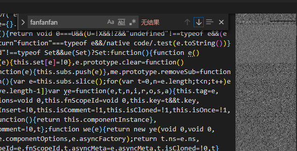

# 开发依赖与运行依赖


### 前言

​      在日常的`vue React Angular`等前端项目中，我们可以通过`npm install`来下载项目所需的依赖。在执行`npm install` 的时候，`npm`工具会根据`package.json`文件中的`dependencies`和`devDependencies`中配置的包名以及版本去下载对应的依赖包。那么它们之间有什么区别呢？

​     首先，显而易见的是，它们的拼写以及读法不同。


​      接下来，我们进入正题。

###      正题

> - `"dependencies"`: Packages required by your application in production.
> - `"devDependencies"`: Packages that are only needed for local development and testing.

​       这是摘抄自官网的一段解释。大概就是说，`dependencies`是你的应用在运行中所必需的依赖包，而`devDependencies`是你的应用只需要在本地环境中所需要依赖包。再通俗点讲，`dependencies`的依赖包在部署到环境上时所需要的（例如：`vue`等），而`devDependencies`的依赖包在编译阶段所需要，而线上环境不需要（例如：`babel esLint`等）。所以我们最直观的判断一个包是需要安装在开发依赖还是运行依赖，就是判断这个包的用途。通过在`npm install`命令后面加不同的参数，那么也就会对应成为不同种类的依赖包。

```shell
npm install <package-name> [--save-prod]    //不加参数默认是 运行依赖
npm install <package-name> --save-dev       //增加为开发依赖包
```

​       据说`devDependencies`的依赖包不会被打包进去，那么是真的吗？眼听为虚，耳见为实，let's go!

​      那么要进行实验的话，我们得控制变量。所以我通过`@vue/cli`工具新建了个项目，创建完成之后，我们引入`element-ui`。我们做实验的结果都基于`element-ui`的打包结果。为了方便查找打包情况，我们在`el-button`组件中增加如下代码`console.log('fanfanfan111')`，所以在最后的打包结果中，我们只需要搜索`fanfanfan`就行。如果包含有这个那么就代表`element-ui`被打包进去了。

1. ​      `npm install element-ui`：这种情况下，相当于把依赖包安装进了运行依赖，执行打包命令。我们在打包完成之后`dist/js`文件夹下的`js`文件中找到了我们的标记物`fanfanfan`。

   ```js
   methods:{handleClick:function(e){console.log("fanfanfan111"),this.$emit("click",e)}}}
   ```

2. 手动将`element-ui`从`dependencies`移到`devDependencies`中：之所以这么做，是为了验证我的一个猜想。我猜依赖包一直都在`node_modules`文件夹中，之所以会出现打包不同的情况，是因为在打包的时候会读取`package.json`中的配置，如果碰到是`devDependencies`中的依赖包，就不把它下面的依赖包打包进项目中。经过试验，我发现我的想法是错的，`element-ui`还是会被打包进项目中。*所以，在打包的时候，到底是通过什么来区分改依赖包打包进项目的呢？*我暂时不得而知，所以，先放一下这个疑问，我们继续下去。

3. `npm install element-ui --save-dev`：这种情况下，相当于把依赖包安装进了开发依赖，执行打包命令。我们在打包完成之后的`dist/js`文件夹下的`js`文件中未发现我们的标记物`fanfanfan`。

 所以，综上所述，`devDependencies`的依赖包不会被打包进去是真的！

# 遗留问题

***为什么打包的时候开发依赖不会被打包进去？或者说打包的时候是通过什么标志来判断是否打包进项目的？***


------

# 参考资料

- `npm`官网([Specifying dependencies and devDependencies in a package.json file](https://docs.npmjs.com/specifying-dependencies-and-devdependencies-in-a-package-json-file))

