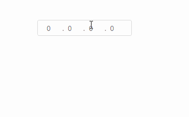

# 仿微软的IP输入框


### 前言

​       最近在单位的一次常规需求当中，原型图上有一个ip的输入框，用于控制可访问资源的ip地址。需求没有给出很具体的ip输入框的具体的功能，只要要求能用就可以了。由于没有对此功能的具体的描述，于是我参考了微软的IP输入框作为我实现的模板。【本文是基于*vue2.x、 antd vue 1.7.8* 版本】。

### 需求分析

​     

经过一段时间的研究，总结的功能需求如下（总体会按照下方列出的来实现）：

- 输入框最多支持输入三位数字，且超过255的数字在失焦的时候会被转换为255
- 输入框无法输入出数字、英文标点之外的字符
- 当输入框内的数字是3位的时候自动聚焦到下一个输入框
- **按下箭头左键以及右键鼠标光标依次按顺序跳动**
- 当鼠标光标位于输入的末尾时，按下句号键可跳转到下一个输入框
- 可以按删除键删除数字
- may be more...

需求分析完毕，那就开始写代码吧！

### 代码实现

##### 1、初始化

首先我们要做的是打地基，初始化一些必要的数据以及样式，通过下面的代码我们会得到一个基本功能的ip输入框，代码如下所示：

```vue
<template>
  <ul class="fan-ip-addr">
    <li v-for="(item, index) in ip" :key="index" class="fan-ip-item">
      <a-input
        size="small"
        v-model.number="item.value"
        class="fan-ip-input"
      ></a-input>
      <span class="fan-ip-dot" v-if="index < 3"></span>
    </li>
  </ul>
</template>
<script>
import { Input } from "ant-design-vue";
export default {
  name: "fanIpinputs",
  data() {
    return {
      ip: [{ value: 0 }, { value: 0 }, { value: 0 }, { value: 0 }],
    };
  },
  components: {
    aInput: Input,
  },
};
</script>
<style lang="less" scoped>
.fan-ip-addr {
  display: inline-flex;
  list-style: none;
  border: 1px solid #d9d9d9;
  border-radius: 4px;
  padding: 0px 10px;
  justify-content: space-around;
  width: 190px;
  height: 32px;
  & .fan-ip-item {
    line-height: 32px;
    & .fan-ip-dot {
      display: inline-block;
      width: 2px;
      height: 2px;
      background: #9b8d8d;
      border-radius: 50%;
      box-shadow: 0 0 0 1px #fff;
    }
    & .fan-ip-input {
      border: none;
      width: 40px;
      position: relative;
      padding: 3px 8px;
      &:focus {
        box-shadow: none;
      }
    }
  }
}
</style>
```

##### 2、自定义v-model

​     通过对vue官网对于[自定义组件的v-model](https://cn.vuejs.org/v2/guide/components-custom-events.html#自定义组件的-v-model)的阅读，我们知道可以通过组件的`model`选项来配置对应的prop以及emit事件。这里还有一个问题，就是我定义的prop传入的数据是一个String（0.0.0.0）形式的，而在组件中为了绑定4个input的model,在组件内我维护的是一个数组。所以我们在emit抛给父组件的时候，要把数组转换为字符串再传递给父组件，而从父组件传进来的字符串同样也需要处理成数组形式才行。所以我加了watch，通过监听prop来处理传进来的值。

​     所以首先我们给`a-input`组件绑定`change`事件，在值发生变化的时候，处理成需要的ip格式，并且通过`result`的emit事件抛出去：

```js
   changeIp(e, index) {
        const resultIp = this.ip.map((ip) => ip.value).join(".");
        this.$emit("result", resultIp);
    }
```

   其次，针对传进来的prop的值，我们通过`watch`来处理，：

```js
  watch: {
    value: {
      immediate: true,
      handler: function (newIp, oldIp) {
        this.ip = [];
        newIp.split(".").forEach((ele) => {
          this.ip.push({ value: ele });
        });
      },
    },
  },
```

经过这样子处理之后，我们可以通过`<fan-ip-input v-model="ip"></fan-ip-input>`来使用此组件。

##### 3、鼠标光标

​       当我实现了上述功能以及`输入框最多支持输入三位数字，且超过255的数字在失焦的时候会被转换为255`需求之后，我开始着手实现按箭头键光标依次跳动的相关功能。最开始我在需求分析的时候，没有仔细在意到**鼠标光标依次跳动**这个关键点【*ps:虽然需求分析出来了，但是脑子里当时想的都仅仅是按下按键聚焦到下一个输入框的功能，就觉得应该都挺简单的*】，等到具体代码实现的时候，我就突然懵了，**我该怎么判断鼠标位置**？


​        我最开始的想法是通过`event.screenX`的值来判断鼠标位置，然后根据输入框的一些位置信息来判断鼠标的位置，以达到鼠标光标依次跳动的功能。但稍加思考，觉得这么做太不靠谱了。于是向百度求助，果然，百度告诉我，可以通过`selectionStart`来获取鼠标光标的位置以及设置鼠标光标的位置。【[HTMLInputElement.setSelectionRange() - Web API 接口参考 | MDN (mozilla.org)](https://developer.mozilla.org/zh-CN/docs/Web/API/HTMLInputElement/setSelectionRange)】

​       所以代码都呼之欲出了：

```js
    pressKey(e, index, item) {
      switch (e.code) {
        case "ArrowRight":
          if (item.value.toString().length === e.currentTarget.selectionStart) {
           this.$refs.ipInput[index === 3 ? 0 : index + 1].focus();
          break;
        case "ArrowLeft":
          if (e.currentTarget.selectionStart === 0) {
              this.$refs.ipInput[index === 0 ? 3 : index - 1].focus();
          }
          break;
        default:
          break;
      }
    },
```

​     但是，问题却紧接着而来，`item.value.toString().length === e.currentTarget.selectionStart`，这个判断虽然可以判断出鼠标光标到达最后一位的时候才聚焦到下一个输入框，但是很遗憾的是，这个判断无法做到一次光标移动。也就是当我按下右方向键的时候，在未到达最后一个光标位置的时候，是可以做到依次移动，但是等到达最后一个光标位置的时候，光标按照理想中，应该停留在末尾，再次按下右方向键才会跳转到下一个输入框。但实际上是直接跳转到可下一个输入框。为了解决此问题，我为每个输入框定义了一个flag，该flag记录了是否到达最后一位（或者第一位）的时候，是应该停留在当前的输入框还是跳转到下一个输入框。

```js
  data() {
    return {
      firstFlag: [
        { start: true, end: true },
        { start: true, end: true },
        { start: true, end: true },
        { start: true, end: true },
      ],
    };
  },
```

在失焦、聚焦、按键等事件触发的时候，正确的改变此flag的值，就可以做到鼠标光标依次跳动。

##### 4、控制输入框的输入

​     这个看起来是不是很简单？是的，没有错。我们只需要绑定一个按键按下的事件，并且给不需要的按键直接`return false`就行了。

```js
    keydown(e, index) {
      const allowKey = [
        "Backspace",
        // "Period",
        "ArrowRight",
        "ArrowLeft",
        "Digit1",
        "Digit2",
        "Digit3",
        "Digit4",
        "Digit5",
        "Digit6",
        "Digit7",
        "Digit8",
        "Digit9",
        "Digit0",
      ];
      if (!allowKey.includes(e.code)) {
        e.preventDefault();
      }
    },
```

​      看起来，已经实现了，对吗？

​      并不对！！！

​      在实际测试的过程中，中文输入法并不会被阻止！也就是说，在中文输入法的情况下，我还是可以输入`q`等之类的按键。此时的我，心态发生了亿乃乃的变化。我很想忽略掉这个问题，并且把锅甩给用户，简单的在ip输入框的右边加个提示符`请使用英文输入法输入IP`,但，这合理吗？这是一个前端工程师该有的作为吗？

​     经过短短半个月时间的思想斗争，我想开了，微笑的面对它吧！去解决它！

​    通过对资料的搜索整理，我在[input输入中文时,如何过滤掉拼音 - 掘金 (juejin.cn)](https://juejin.cn/post/6844904197029117965)该文找到了中文输入法触发的事件：

> **keydown**：按下一个键触发事件；
> **keypress**：按下通常会产生字符值的键。此事件高度依赖设备，**废弃；**
> **keyup**：释放一个键触发事件；
> **compositionstart**：当用户使用拼音输入法开始输入汉字时，这个事件就会被触发；
> **compositionupdate**：事件触发于字符被输入到一段文字的时候；
> **compositionend：**当文本段落的组成完成或取消时, compositionend 事件将被触发；
> **input：**元素的 `value` 被修改时，会触发 `input` 事件
> **change：**当用户提交对元素值的更改时。与  `input` 事件不同，change 事件不一定会对元素值的每次更改触发。

​      所以我们只需要绑定**compositionstart**、**compositionend**的事件，每次都记录中文输入法输入的文字，最后再通过正则去掉因为中文输入法索输入的文字，就可以做到中文输入法下文字的控制与清除。

​     代码如下：

```js
    compositionstart(e, index) {
      console.log("compositionstart", e);
      this.shouldLockKeyupEvent = true; //在pressKey函数中使用
    },
    compositionend(e, index) {
      console.log("compositionend", e);
      this.shouldRemoveText = e.data;
    },
        
    changeIp(e, index) {
      if (this.shouldRemoveText) {
        const { value } = e.currentTarget;
        const iindex = value.indexOf(this.shouldRemoveText);
        if (iindex >= 0) {
          this.ip[index].value = value.replace(
            new RegExp(this.shouldRemoveText, "g"),
            ""
          );
          this.shouldLockKeyupEvent = false;
          this.shouldRemoveText = "";
        } else {
          console.error(`we didn't match the text in ${index} value😅`);
        }
      } 
    },
```

##### 5、其它

​     经过上述的代码，我们已经实现了，一个ip输入框的基本功能了。此外一些功能细节完善,比如失焦的时候，自动把超出255范围的改成255 等。具体的代码可以在[24min/ip-input: Imitation of Microsoft IP input box (github.com)](https://github.com/24min/ip-input)此仓库查看。此外，我将此组件上传到了npm上【[fan-ip-input - npm (npmjs.com)](https://www.npmjs.com/package/fan-ip-input)】，也可以直接通过`npm install fan-ip-input`安装使用。

##### 6、最终效果



### 总结

​        这个就是仿微软的ip输入框，本以为是不太难的，但现实是实现起来，会碰到意料之外的状况。这些状况可能会超出自己的知识储备，但通过不断的摸索学习，最终解决，这个对我而言的成就感是非常大的，并且确实学到了许多。

