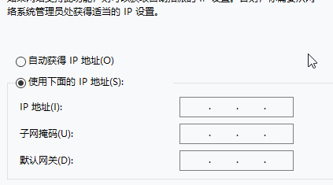

# 仿微软的IP输入框


### 前言

​       最近在单位的一次常规需求当中，原型图上有一个ip的输入框，用于控制可访问资源的ip地址。需求没有给出很具体的ip输入框的具体的功能，只要要求能用就可以了。由于没有对此功能的具体的描述，于是我参考了微软的IP输入框作为我实现的模板。【本文是基于*vue2.x、 antd vue 1.7.8* 版本】。

### 需求分析

​     

经过一段时间的研究，总结的功能需求如下（总体会按照下方列出的来实现）：

- 输入框最多支持输入三位数字，且超过255的数字在失焦的时候会被转换为255
- 输入框无法输入出数字、英文标点之外的字符
- 当输入框内的数字是3位的时候自动聚焦到下一个输入框
- **按下箭头左键以及右键鼠标光标依次按顺序跳动**
- 当鼠标光标位于输入的末尾时，按下句号键可跳转到下一个输入框
- 可以按删除键删除数字
- may be more...

需求分析完毕，那就开始写代码吧！

### 代码实现

##### 1、初始化

首先我们要做的是打地基，初始化一些必要的数据以及样式，通过下面的代码我们会得到一个基本功能的ip输入框，代码如下所示：

```vue
<template>
  <ul class="fan-ip-addr">
    <li v-for="(item, index) in ip" :key="index" class="fan-ip-item">
      <a-input
        size="small"
        v-model.number="item.value"
        class="fan-ip-input"
      ></a-input>
      <span class="fan-ip-dot" v-if="index < 3"></span>
    </li>
  </ul>
</template>
<script>
import { Input } from "ant-design-vue";
export default {
  name: "fanIpinputs",
  data() {
    return {
      ip: [{ value: 0 }, { value: 0 }, { value: 0 }, { value: 0 }],
    };
  },
  components: {
    aInput: Input,
  },
};
</script>
<style lang="less" scoped>
.fan-ip-addr {
  display: inline-flex;
  list-style: none;
  border: 1px solid #d9d9d9;
  border-radius: 4px;
  padding: 0px 10px;
  justify-content: space-around;
  width: 190px;
  height: 32px;
  & .fan-ip-item {
    line-height: 32px;
    & .fan-ip-dot {
      display: inline-block;
      width: 2px;
      height: 2px;
      background: #9b8d8d;
      border-radius: 50%;
      box-shadow: 0 0 0 1px #fff;
    }
    & .fan-ip-input {
      border: none;
      width: 40px;
      position: relative;
      padding: 3px 8px;
      &:focus {
        box-shadow: none;
      }
    }
  }
}
</style>
```

##### 2、自定义v-model

​     通过对vue官网对于[自定义组件的v-model](https://cn.vuejs.org/v2/guide/components-custom-events.html#自定义组件的-v-model)的阅读，我们知道可以通过组件的`model`选项来配置对应的prop以及emit事件。这里还有一个问题，就是我定义的prop传入的数据是一个String（0.0.0.0）形式的，而在组件中为了绑定4个input的model,在组件内我维护的是一个数组。所以我们在emit抛给父组件的时候，要把数组转换为字符串再传递给父组件，而从父组件传进来的字符串同样也需要处理成数组形式才行。所以我加了watch，通过监听prop来处理传进来的值。

​     所以首先我们给`a-input`组件绑定`change`事件，在值发生变化的时候，处理成需要的ip格式，并且通过`result`的emit事件抛出去：

```js
   changeIp(e, index) {
        const resultIp = this.ip.map((ip) => ip.value).join(".");
        this.$emit("result", resultIp);
    }
```

   其次，针对传进来的prop的值，我们通过`watch`来处理，：

```js
  watch: {
    value: {
      immediate: true,
      handler: function (newIp, oldIp) {
        this.ip = [];
        newIp.split(".").forEach((ele) => {
          this.ip.push({ value: ele });
        });
      },
    },
  },
```

经过这样子处理之后，我们可以通过`<fan-ip-input v-model="ip"></fan-ip-input>`来使用此组件。

##### 3.鼠标光标

​       当我实现了上述功能以及`输入框最多支持输入三位数字，且超过255的数字在失焦的时候会被转换为255`需求之后，我开始着手实现按箭头键光标依次跳动的相关功能。最开始我在需求分析的时候，没有仔细在意到**鼠标光标依次跳动**这个关键点【*ps:虽然需求分析出来了，但是脑子里当时想的都仅仅是按下按键聚焦到下一个输入框的功能，就觉得应该都挺简单的*】，等到具体代码实现的时候，我就突然懵了，**我该怎么判断鼠标位置**？


todo....

