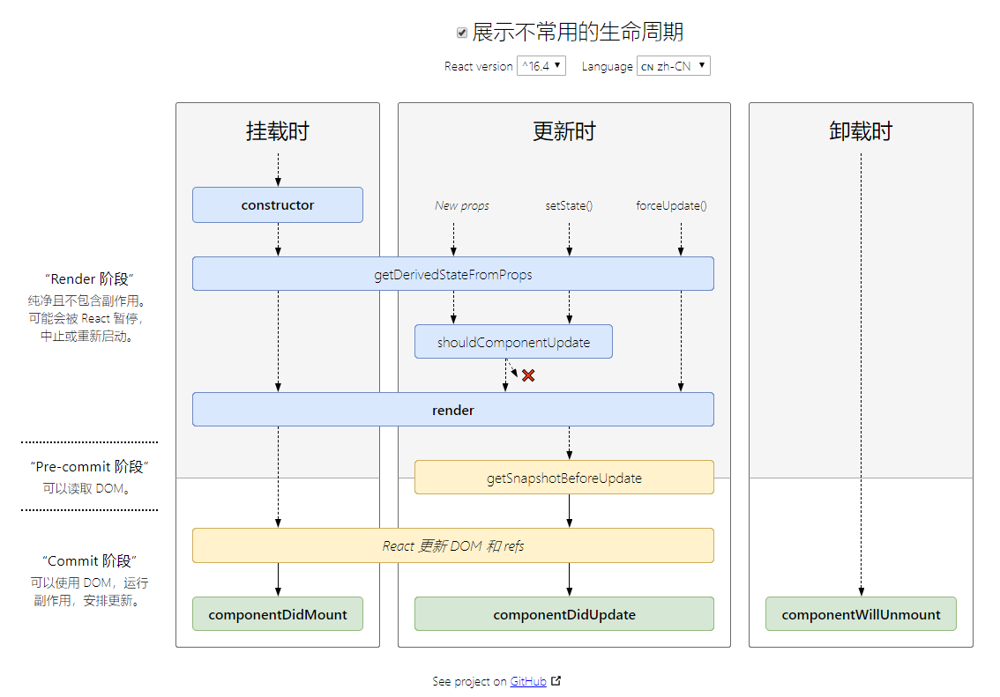

# 前言

------

​       最近想学习一下React。所以这个文章将会以问答的形式，呈现我在学习react中自己的疑惑，并尽力思考解决我自己提出的问题。

### Q1：React中通过`map`循环元素，那么在下面代码中我可以直接把`map`换成`forEach`吗？

> ```react
> 
> import React, { PureComponent as Component } from 'react'
> function NumberList(props) {
>     const numbers = props.numbers
> // return (<ul>{numbers.forEach(num => <li>{num}</li> )}</ul>)  
>     return (<ul>{numbers.map(num=> <li>{num}</li> )}</ul>)
> }
> export default class Test extends Component {
>     constructor(props) {super(props)}
>     render() {
>         return (
>             <div>
>                 <NumberList numbers={[1, 2, 3, 5]} />
>             </div>
>         )
>     }
> }
> ```
>
> 

**解：**答案是**不可以**！如果我们把`map`直接替换成`forEach`在界面上是看不到预期的循环效果的。这是因为`map`在循环的时候最后会返回一个新数组，而`forEach`没有返回。所以就导致改成`forEach`的时候在界面上看不到效果，但实际上是循环了的。那么我们如果一定要用`forEach`的话，我们就需要个其他变量来存储循环结果。代码如下：

```js
function NumberList(props) {
    const numbers = props.numbers
    const arr = []
    numbers.forEach(num => {
     arr.push(<li>{num}</li>)   
    })
    return (<ul>{arr}</ul>)   
}
```

------

### Q2:为什么不能在自定义组件上直接绑定`onClick`事件？

**解：**自定义组件并不是一个真实的DOM元素。它不存在`onClick`事件，React只会认为这是`onClick`属性。

------

### Q3：通过`class`类定义的组件中构造器（constructor）函数中的`super()`起什么作用？

> ```js
> export default class Test extends Component {
>     constructor(props) {super(props)}
>     componentWillMount() { }
>     componentDidMount() { }
>     render() {return (<div>111</div>)}
> }
> ```
>
> 

**解：**这个知识点是关于[es6的对象的继承](https://es6.ruanyifeng.com/#docs/class-extends)。子类必须在`constructor`方法中调用`super`方法，否则新建实例时会报错。这是因为子类自己的`this`对象，必须先通过父类的构造函数完成塑造，得到与父类同样的实例属性和方法，然后再对其进行加工，加上子类自己的实例属性和方法。如果不调用`super`方法，子类就得不到`this`对象。比如下面的代码：

```js
class father{}
class son extends father{
    constructor(){}
}
let new_son = new son()  
//Uncaught ReferenceError: Must call super constructor in derived class before accessing 'this' or returning from derived constructor

```

***注意：***假如在父类中不显示定义`constructor(){}`，那么引擎会自动添加空。对于继承的子类，假如不显示定义`constructor`方法，那么引擎会默认添加` constructor(...args) { super(...args);}`。

------

### Q4：React组件的生命周期有哪些？

**解：**



当一个React组件被创建时，首先是经历组件挂载(当组件实例被创建并插入 DOM 中)的阶段：

- [**`constructor()`**](https://zh-hans.reactjs.org/docs/react-component.html#constructor)
- [`static getDerivedStateFromProps()`](https://zh-hans.reactjs.org/docs/react-component.html#static-getderivedstatefromprops)
- [**`render()`**](https://zh-hans.reactjs.org/docs/react-component.html#render)
- [**`componentDidMount()`**](https://zh-hans.reactjs.org/docs/react-component.html#componentdidmount)

当组件的 props 或 state 发生变化时会触发更新。组件更新的生命周期调用顺序如下：

- [`static getDerivedStateFromProps()`](https://zh-hans.reactjs.org/docs/react-component.html#static-getderivedstatefromprops)
- [`shouldComponentUpdate()`](https://zh-hans.reactjs.org/docs/react-component.html#shouldcomponentupdate)
- [**`render()`**](https://zh-hans.reactjs.org/docs/react-component.html#render)
- [`getSnapshotBeforeUpdate()`](https://zh-hans.reactjs.org/docs/react-component.html#getsnapshotbeforeupdate)
- [**`componentDidUpdate()`**](https://zh-hans.reactjs.org/docs/react-component.html#componentdidupdate)

当组件从 DOM 中移除时会调用如下方法：

- [**`componentWillUnmount()`**](https://zh-hans.reactjs.org/docs/react-component.html#componentwillunmount)

------

### Q5：为什么引入React组件的时候要使用`PureComponent`?

> ```js
> import React, { PureComponent as Component } from 'react';
> ```

*注:这个是我在看`yapi`这个项目时候的一个疑惑。为什么要用`PureComponent`？*

`React.Component`和`React.PureComponent`几乎完全相同。区别在于 [`React.Component`](https://zh-hans.reactjs.org/docs/react-api.html#reactcomponent) 并未实现 [`shouldComponentUpdate()`](https://zh-hans.reactjs.org/docs/react-component.html#shouldcomponentupdate)，而 `React.PureComponent` 中以浅层对比 prop 和 state 的方式来实现了该函数。也就是说假如你的新建的组件从`PureComponent`继承，基本类型的值改变以及引用类型的指向地址改变才会触发渲染。那么什么时候该用`React.Component`？什么时候该用`React.PureComponent`呢？一般来说你的数据会发生频繁变化的时候使用`React.Component`。

我大致翻了一下`yapi`的项目，基本都使用`PureComponent`来创建组件。

[关于两个区别的详解](https://juejin.im/post/5b614d9bf265da0fa759e84b)  [官网解释](https://zh-hans.reactjs.org/docs/react-api.html)

